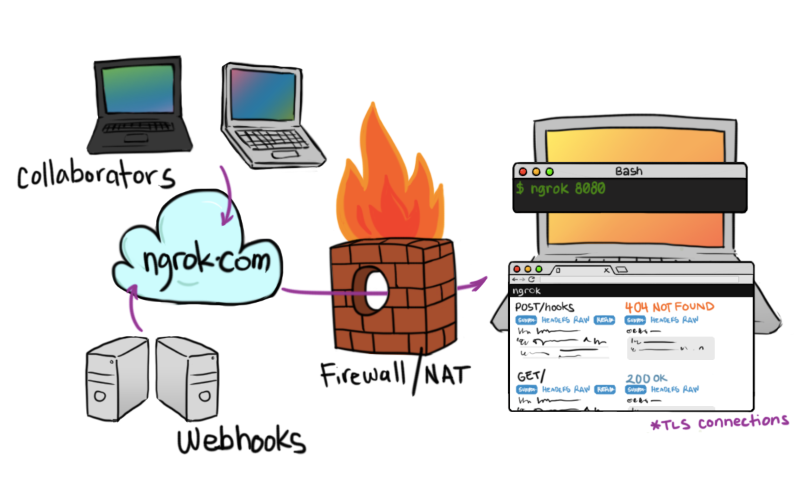
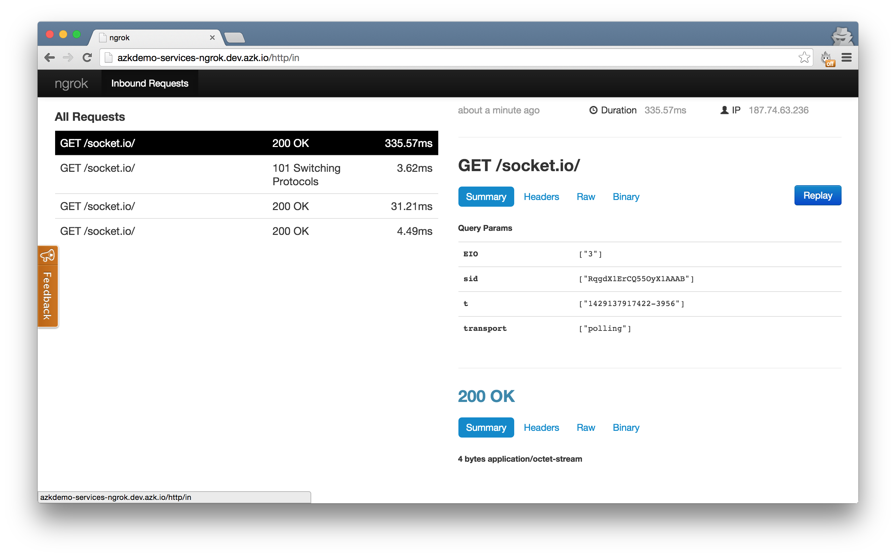
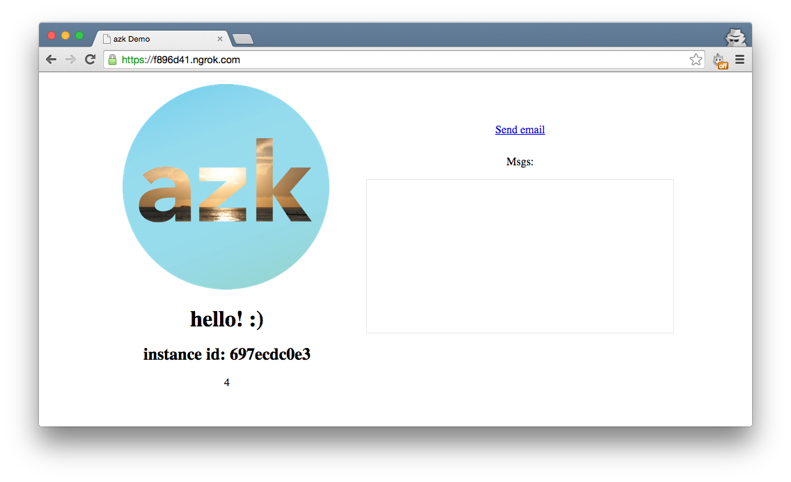
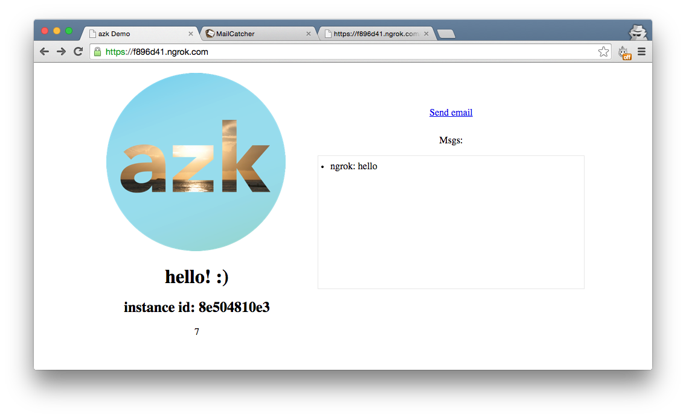

# ngrok


> Screenshot from [ngrok's GitHub page](https://github.com/inconshreveable/ngrok)

> Note: You can check the final result on the branch [ngrok-final](https://github.com/azukiapp/azkdemo-services/tree/ngrok-final) from the project [azkdemo-services](https://github.com/azukiapp/azkdemo-services/).

[ngrok](https://ngrok.com/) is a reverse proxy that creates a secure tunnel from a public endpoint to a locally running web service. To put it in another words, you can use ngrok to expose a port in your system, for example the port your Node.js application is running on, to a public URL. It'll also give you a really neat web interface to analyze all the traffic sent over to your application, and even replay requests.



One scenario where ngrok can be really useful is if you need to test webhooks. A webhook is basically a POST request made to your web service. A lot of companies like [GitHub](https://developer.github.com/webhooks/), [Evernote](https://dev.evernote.com/doc/articles/polling_notification.php), [SendGrid](https://sendgrid.com/docs/API_Reference/Webhooks/index.html), [Twilio](https://www.twilio.com/platform/webhooks), offer webhooks for different purposes.

In our case, what we'll do is add ngrok to our application, and for simplicity, add a GET route that we can use to add a message to our application's message box, similar to what happened when we sent emails by clicking on the "Send email" button in the [last section](./mailcatcher.md).

Let's get started! We'll assume that you're coming from the last section, [MailCatcher](./mailcatcher.md). In case you want to start directly from this section, download the starter project and change branches by running:

```javascript
$ git clone https://github.com/azukiapp/azkdemo-services.git
$ git checkout mailcatcher-final
```

First of all, let's add the `ngrok` system to our Azkfile.js. Open your file and add it to the bottom:

```javascript
...
  // MailCatcher system
  mail: {
    ...
  }

  // ngrok system
  ngrok: {
    // Dependent systems
    depends: ["azkdemo-services"],
    // More images:  http://images.azk.io
    image: {"docker": "azukiapp/ngrok:latest"},
    wait: {"retry": 20, "timeout": 1000},
    http: {
      domains: [
        "#{manifest.dir}-#{system.name}.#{azk.default_domain}",
      ],
    },
    ports: {
      // exports global variables
      http: "4040",
    },
    envs: {
      // set instances variables
      NGROK_CONFIG: "/ngrok/ngrok.yml",
      NGROK_LOG: "/ngrok/logs/ngrok.log",
    },
  },
}
```

You can see that we added our "azkdemo-services" system as a dependency to our "ngrok" system. Why's that?

Well, unlike other services such as MailCatcher, ngrok needs to have a web service running in a port before we start it. By adding our Node.js application to the `depends` parameter, we ensure that'll be the case.

One more thing before running our systems, we need to actually tell ngrok not only the port, but the URL it can find our application. So let's do that by exporting an environment variable in our "azkdemo-services" system. Add the `export_envs` property to it:

```javascript
...
  'azkdemo-services': {
    // Dependent systems
    depends: ["mail", "redis"],
    // More images:  http://images.azk.io
    image: {"docker": "azukiapp/node:0.12"},
    // Steps to execute before running instances
    provision: [
      "npm install",
    ],
    workdir: "/azk/#{manifest.dir}",
    shell: "/bin/bash",
    command: "npm start",
    wait: {"retry": 20, "timeout": 1000},
    mounts: {
      '/azk/#{manifest.dir}': path("."),
      '/azk/#{manifest.dir}/node_modules': persistent("#{system.name}-node_modules"),
    },
    scalable: {"default": 1},
    http: {
      domains: [ "#{system.name}.#{azk.default_domain}" ]
    },
    envs: {
      // set instances variables
      NODE_ENV: "dev",
    },
    export_envs: {
      // exports variables for dependent systems
      APP_URL: "#{system.name}.#{azk.default_domain}:#{net.port.http}",
    },
  },
  ...
}
```

The APP_URL will be available to the ngrok system, and it'll use that to expose our Node.js application. Let's run it:

```
$ azk start
```

You should see the following output:

```
┌───┬─────────────────────┬───────────┬──────────────────────────────────────────┬────────────────────────────┬──────────────┐
│   │ System              │ Instances │ Hostname/url                             │ Instances-Ports            │ Provisioned  │
├───┼─────────────────────┼───────────┼──────────────────────────────────────────┼────────────────────────────┼──────────────┤
│ ↑ │ redis               │ 1         │ dev.azk.io                               │ 1-6379:49351               │ -            │
├───┼─────────────────────┼───────────┼──────────────────────────────────────────┼────────────────────────────┼──────────────┤
│ ↑ │ mail                │ 1         │ http://mail.azkdemo.dev.azk.io           │ 1-smtp:49358, 1-http:49357 │ -            │
├───┴─────────────────────┴───────────┴──────────────────────────────────────────┴────────────────────────────┴──────────────┤
│ ↑ │ azkdemo-services    │ 1         │ http://azkdemo-services.dev.azk.io       │ 1-http:49352               │ -            │
├───┼─────────────────────┼───────────┼──────────────────────────────────────────┼────────────────────────────┼──────────────┤
│ ↑ │ ngrok               │ 1         │ http://azkdemo-services-ngrok.dev.azk.io │ 1-http:49340               │ -            │
└───┴─────────────────────┴───────────┴──────────────────────────────────────────┴────────────────────────────┴──────────────┘
```

Let's open our ngrok URL: http://azkdemo-services-ngrok.dev.azk.io


Awesome, ngrok is working and we can already check its admin interface that lets us analyze and replay connections. One thing we still can't do is actually see our URL that ngrok created for us as a public endpoint. So let's fix that.

First of all, create a new folder called "logs" in your project directory:

```
$ mkdir logs
```

Now what we can do is pipe any log files created inside the ngrok system to our project directory. Let's do this by editing our Azkfile.js `ngrok` system, and adding the `mounts` parameter:

```javascript
...
  // ngrok system
  ngrok: {
    // Dependent systems
    depends: ["azkdemo-services"],
    // More images:  http://images.azk.io
    image: {"docker": "azukiapp/ngrok:latest"},
    wait: {"retry": 20, "timeout": 1000},
    http: {
      domains: [
        "#{manifest.dir}-#{system.name}.#{azk.default_domain}",
      ],
    },
    ports: {
      // exports global variables
      http: "4040",
    },
    mounts: {
      '/ngrok/logs' : path("./logs"),
    },
    envs: {
      // set instances variables
      NGROK_CONFIG: "/ngrok/ngrok.yml",
      NGROK_LOG: "/ngrok/logs/ngrok.log",
    },
  },
  ...
}
```

The `mounts` parameter will define:

- `'ngrok/logs'`: this is the folder and its contents created inside our system (`ngrok` in this case) that we want to pipe to outside.
- `path("./logs)"`: the `path` options will define where that information will be available in our project directory. In this case, the `./logs` folder we created in the previous step.

Let's restart our system to update it with these changes:

```
$ azk restart
```

Now, after you restart the systems and they're up and running, you should see a new file was created inside our `logs` folder called `ngrok.log`. Open that file and you'll see a bunch of log outputs from `ngrok`. Search for "Tunnel established at" and you'll be able to see our public endpoint that `ngrok` made available for us.

So copy that address (something like https://f896d41.ngrok.com) in your browser and open it. You should see exactly our application:



What's different about this is that you can share that URL with other people and they'll be able to access it, which is exactly the reason why they're useful for quickly testing webhooks without deploying your application.

Just like we said in the beginning of the tutorial, now let's add a GET endpoint in our application that will add a message in our application's message box. Open your `src/index.js` file and add a `/webhook` endpoint to it:

```javascript
...
// Send mail
app.get('/mail', require('./send_email.js'));

// Webhooks
app.get('/webhook', function(req, res) {
  io.sockets.emit('msgs', req.param('msg'));
  res.send('Message sent');
});

// setup views with ejs
app.use('/public', express.static(path.join(rootPath, 'public')));
...
```

Save it, and since we're using `nodemon`, it's going to automatically reload our application. Your `ngrok` URL will also stay the same. If you already had a previous tab open from the last step, just open a new one with the same address (something like https://f896d41.ngrok.com). Now you should have two tabs open with our application. In the second tab, add to the end of the address the following:

```
https://f896d41.ngrok.com/webhook?msg=hello
```

The page should refresh and show a text "Message sent"! Go back to the first tab, and you should see a message saying "ngrok: hello":



And that's it!

Testing a webhook from another service like the ones mentioned in the beginning should be as simple as changing our `/webhook` endpoint to a POST instead of a GET, and then working with the data that will be sent as part of the `req` object. :)

> Note: You can check the final result on the branch [ngrok-final](https://github.com/azukiapp/azkdemo-services/tree/ngrok-final) from the project [azkdemo-services](https://github.com/azukiapp/azkdemo-services/).
