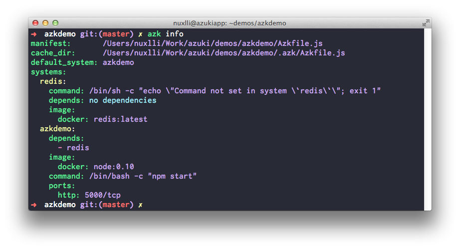

## azk info

Displays information about the systems listed in `Azkfile.js`.

#### Options:

- `--colored, -C`     Displays colored output (default: true)

#### Usage:

     $ azk [options] info [path]

#### Example:

