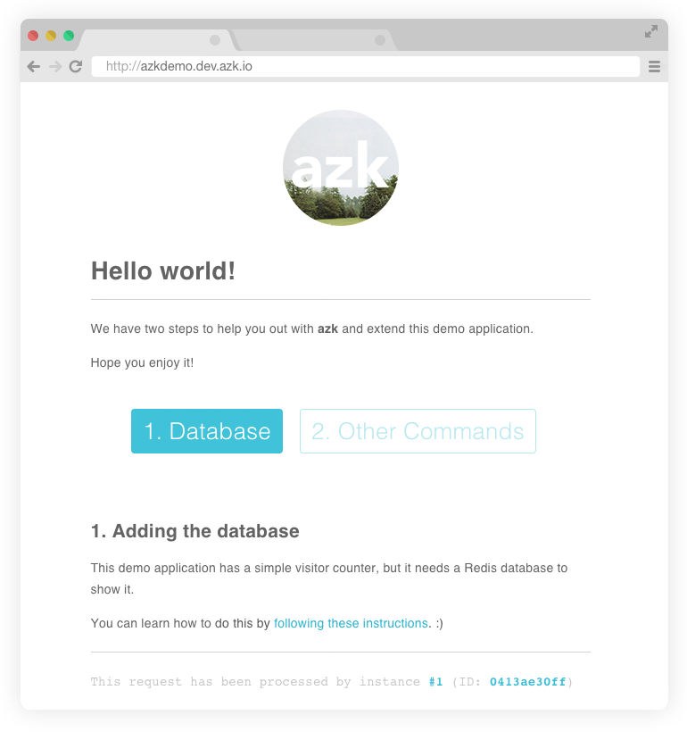

# Running the application

Once the `Azkfile.js` is created, we are ready to start our application:

```bash
$ azk start -vv
```

The output of the command above should look something like this:


If all went as expected now you can access [http://azkdemo.dev.azk.io](http://azkdemo.dev.azk.io) and the following screen should appear:



> **Important**: If you get an error "Webpage is not available", you might have to restart your computer so it can recognize the azk.dev.io DNS resolver. You can confirm this by running: 

> ```$ scutil --dns```

> And checking that the output does not include dev.azk.io. More information can be found here.

Note that when you refresh the page a few times the `instance id` is changed to another value. This happens because there is a load balancer that points to one of two instances of the site.

In the output of `azk status` we can check that there are two instances of the azkdemo system:


This setting, to use two instances, is defined in the Azkfile.js (generated in the [previous step](configs-project.md)):

```js
  //...
  scalable: {"default": 2},
  //...
```
