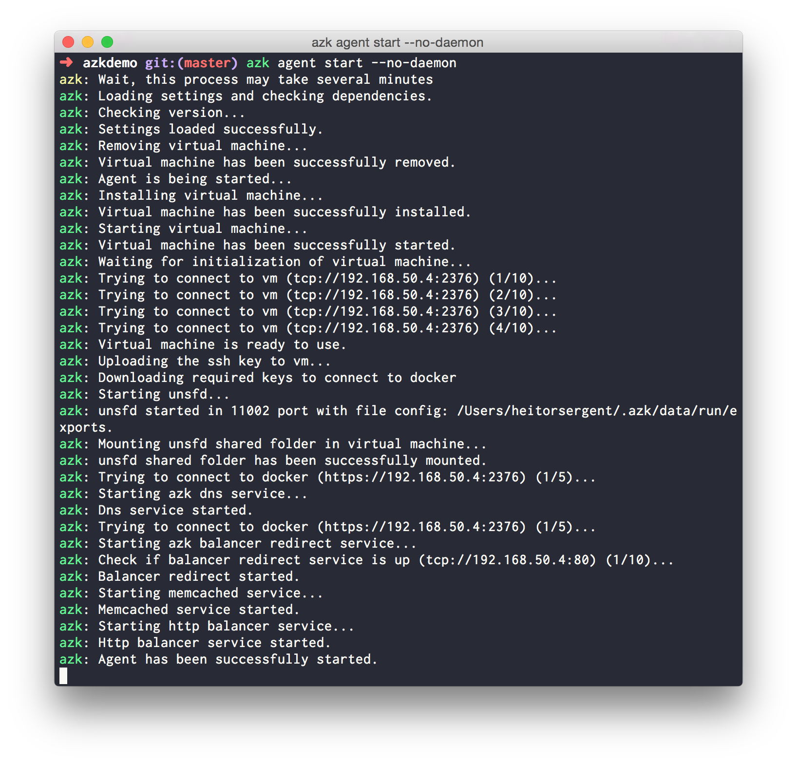

# Starting the agent

The `azk agent` is the **main service** of `azk`. Details of its features and functionality can be found [here](../agent/README.md). For now it is important to know that running it is required for most of the `azk` tasks.

To ensure that the `azk agent` **is running**, you must run the following command in the **terminal**:

```bash
$ azk agent start
```

The output should slightly vary according to the platform (Linux or Mac). But overall you should expect to see the message **"Agent has been successfully started"**, and only then continue following this guide.

> **Important**: Never run `azk agent start` as a super user (not even using sudo), this can lead to an inconsistent state that can make the `azk agent` command to not work.

An output sample for the command:


