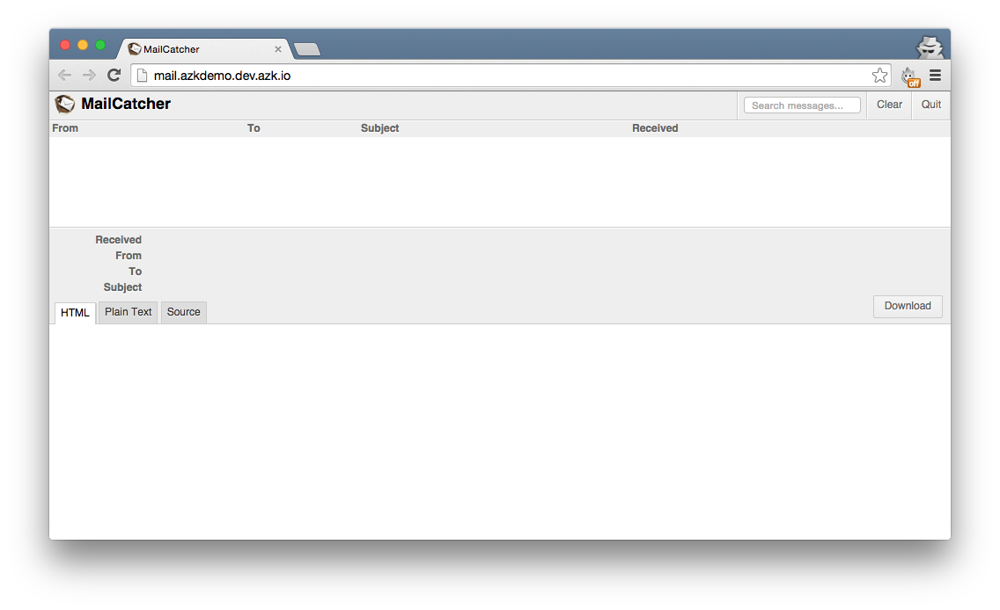
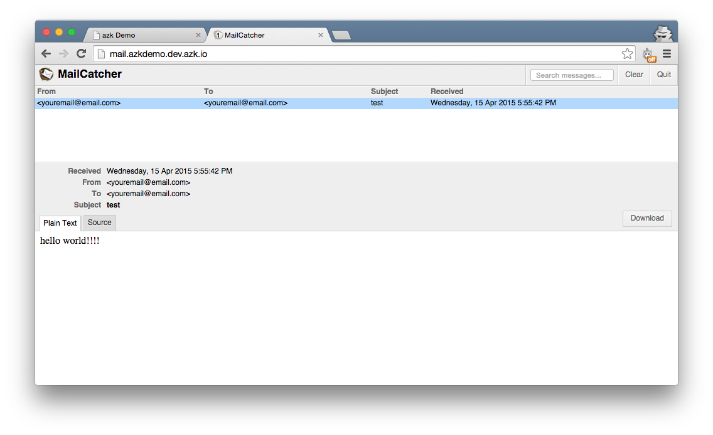

# MailCatcher


> Screenshot da [página do GitHub do MailCatcher](https://github.com/sj26/mailcatcher/)

> Nota: Você pode checar o resultado final na branch [mailcatcher-final](https://github.com/azukiapp/azkdemo-services/tree/mailcatcher-final) do projeto [azkdemo-services](https://github.com/azukiapp/azkdemo-services/).

MailCatcher é um projeto open-source que executa um servidor SMTP que pega qualquer mensagem enviada a ele, e a exibe em uma interface web. Se você percebeu nós já temos um link "Send email" que podemos clicar, mas nada acontece. O que nós vamos fazer é adicionar um método que, quando o botão é clicado, irá enviar um email para o MailCatcher, e então podemos facilmente inspecioná-lo em sua interface web.

Vamos começar adicionando nosso sistema MailCatcher ao Azkfile.js. Abra ele e abaixo do sistema `redis` adicione o seguinte:

```javascript
redis: {
  ...
}

// MailCatcher system
mail: {
    // Dependent systems
    depends: [],
    // More images:  http://images.azk.io
    image: {"docker": "schickling/mailcatcher"},
    http: {
      domains: [
        "#{system.name}.azkdemo.#{azk.default_domain}",
      ],
    },
    ports: {
      // exports global variables
      http: "1080/tcp",
      smtp: "1025/tcp",
    },
  },
```

Agora vamos executar o sistema `mail` e verificar que ele está funcionando:

```
$ azk start mail
```

Você deverá ver o seguinte resultado:

```
┌───┬─────────────────────┬───────────┬────────────────────────────────────┬────────────────────────────┬──────────────┐
│   │ System              │ Instances │ Hostname/url                       │ Instances-Ports            │ Provisioned  │
├───┼─────────────────────┼───────────┼────────────────────────────────────┼────────────────────────────┼──────────────┤
│ ↑ │ mail                │ 1         │ http://mail.azkdemo.dev.azk.io     │ 1-smtp:49358, 1-http:49357 │ -            │
├───┼─────────────────────┼───────────┼────────────────────────────────────┼────────────────────────────┼──────────────┤
│ ↑ │ redis               │ 1         │ dev.azk.io                         │ 1-6379:49351               │ -            │
├───┴─────────────────────┴───────────┴────────────────────────────────────┴────────────────────────────┴──────────────┤
│ ↑ │ azkdemo-services    │ 1         │ http://azkdemo-services.dev.azk.io │ 1-http:49352               │ -            │
└───┴─────────────────────┴───────────┴────────────────────────────────────┴────────────────────────────┴──────────────┘
```

Agora, abra a URL do sistema `mail`: http://mail.azkdemo.dev.azk.io e você deverá ver a interface do MailCatcher:



Nosso próximo passo será adicionar a funcionalidade de envio de e-mail para a nossa aplicação. Abra o arquivo `src/index.js`. Nós já criamos uma rota `get` para o endpoint `/mail` endpoint, então vamos usar ela. Ao invés de escrever tudo dentro dessa função, vamos criar um novo arquivo chamado `send_email.js` dentro da pasta `src`.

```
$ touch src/send_email.js
```

Abra seu arquivo recém-criado e adicione o seguinte:

```javascript
var transporter = null;

if (process.env.MAIL_SMTP_HOST) {
  var nodemailer = require('nodemailer');
  var smtpTransport = require('nodemailer-smtp-transport');

  transporter = nodemailer.createTransport(smtpTransport({
    host: process.env.MAIL_SMTP_HOST,
    port: process.env.MAIL_SMTP_PORT,
    ignoreTLS: true
  }));
}

module.exports = function(req, response) {
  if (transporter) {
    var mail = {
      from: 'youremail@email.com',
      to: 'youremail@email.com',
      subject: 'test',
      text: 'hello world!!!!'
    };

    transporter.sendMail(mail, function(err, mailResult) {
      var msg = 'E-mail sent to ' + mail.from;
      response.end(msg);
    });
  } else {
    response.end('mail not active, try azk start mail');
    console.log('transporter:', transporter);
    console.log('process.env.MAIL_SMTP_HOST:', process.env.MAIL_SMTP_HOST);
    console.log('process.env.MAIL_SMTP_PORT:', process.env.MAIL_SMTP_PORT);
  }
}
```

Vamos usar os módulos [nodemailer](https://github.com/andris9/Nodemailer) e o [nodemailer-smtp-transport](https://github.com/andris9/nodemailer-smtp-transport) para enviar um email para o nosso servidor SMTP do MailCatcher. Volte para o arquivo `src/index.js` e mude o endpoint `/mail` para o seguinte:

```javascript
// Send mail
app.get('/mail', require('./send_email.js'));
```

O nosso endpoint está pronto para enviar um email. Agora vamos fazer com que o link "Enviar e-mail" esteja conectado a esse endpoint `/mail`. Abra o `views/home/index.ejs` e adicione o seguinte ` script` abaixo da tag script `jquery`:

```html
    <script>
      var ajaxUrl = "/mail";
      $(document).ready(function() {
        $('#btn_send').on('click', function(e){
          $.get(ajaxUrl, function(result){
            $('#emails_received').append('<li>' + result + "</li>");
          });
          e.preventDefault();
        });

        var socket = io.connect();
        socket.on('msgs', function(data) {
          console.log(data);
          $('#emails_received').append("<li>ngrok: " + data + "</li>");
        });
      });
    </script>
```

Ok, então agora temos quase tudo pronto! Nós só precisamos de um último passo para fazer com que tudo funcione corretamente. Você deve ter notado que em nosso arquivo `src/send_email.js` temos duas variáveis ​​de ambiente, `process.env.MAIL_SMTP_HOST` e `process.env.MAIL_SMTP_PORT`. Elas vêm do sistema `mail`, por isso precisamos adicioná-lo como dependência do nosso sistema `node` para que essas variáveis possam também estar disponíveis para ele. Abra o seu `Azkfile.js` e dentro de ` azkdemo-services` no parâmetro `depends` adicione:

```javascript
'azkdemo-services': {
    // Dependent systems
    depends: ["mail", "redis"],
    ...
  },
  ...
}
```

Agora estamos com tudo pronto! Vamos testar nossa aplicação, execute:

```
$ azk restart
```

Abra o URL para a nossa aplicação Node.js e clique em "Send email": http://azkdemo-services.dev.azk.io você deverá ver:


E se você abrir a URL para a nossa aplicação MailCatcher, você deverá ser capaz de ver o email enviado pela nossa aplicação e seu conteúdo: http://mail.azkdemo.dev.azk.io



E é só isso! Na próxima seção, vamos cobrir como adicionar o `ngrok` a sua aplicação para que você possa testar webhooks. :)

> Nota: Você pode checar o resultado final na branch [mailcatcher-final](https://github.com/azukiapp/azkdemo-services/tree/mailcatcher-final) do projeto [azkdemo-services](https://github.com/azukiapp/azkdemo-services/).
