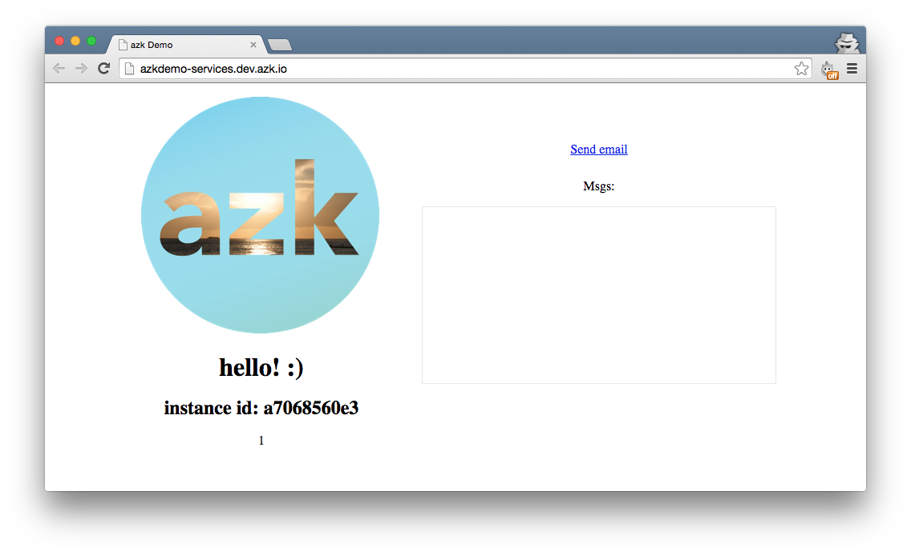

# Executando nossa aplicação

Nossa aplicação de exemplo vem pré-configurada com um Azkfile.js contendo nossos sistemas **Node.js** e **Redis**.

Vamos executá-la:

```sh
$ azk start
```

Você deverá ver o seguinte output:

```
azk: ↑ starting `redis` system, 1 new instances...
azk: ✓ checking `library/redis:latest` image...
azk: ◴ waiting for `redis` system to start, trying connection to port 6379/tcp...
azk: ↑ starting `azkdemo-services` system, 1 new instances...
azk: ✓ checking `azukiapp/node:0.12` image...
azk: ◴ waiting for `azkdemo-services` system to start, trying connection to port http/tcp...

┌───┬─────────────────────┬───────────┬────────────────────────────────────┬─────────────────┬──────────────┐
│   │ System              │ Instances │ Hostname/url                       │ Instances-Ports │ Provisioned  │
├───┼─────────────────────┼───────────┼────────────────────────────────────┼─────────────────┼──────────────┤
│ ↑ │ redis               │ 1         │ dev.azk.io                         │ 1-6379:49351    │ -            │
├───┴─────────────────────┴───────────┴────────────────────────────────────┴─────────────────┴──────────────┤
│ ↑ │ azkdemo-services    │ 1         │ http://azkdemo-services.dev.azk.io │ 1-http:49352    │ -            │
└───┴─────────────────────┴───────────┴────────────────────────────────────┴─────────────────┴──────────────┘
```

Agora, se você abrir a URL http://azkdemo-services.dev.azk.io, deverá ver:



Com nossa aplicação funcionando, vamos continuar e adicionar o MailCatcher nela. :)
