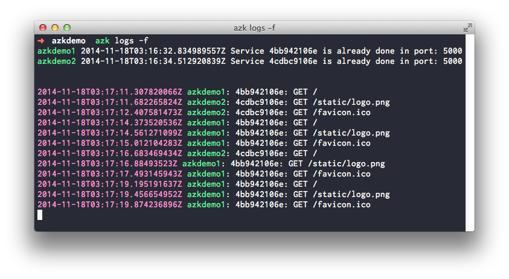

# Logs

Umas das coisas mais importante quando estamos desenvolvendo uma aplicação web é ter acesso aos logs. Para visualizar os logs da aplicação `azkdemo` digite o seguinte comando:

```sh
$ azk logs -f
```

Acessando [http://azkdemo.dev.azk.io](http://azkdemo.dev.azk.io) algumas vezes, devemos obter um log parecido com o exibido abaixo:



