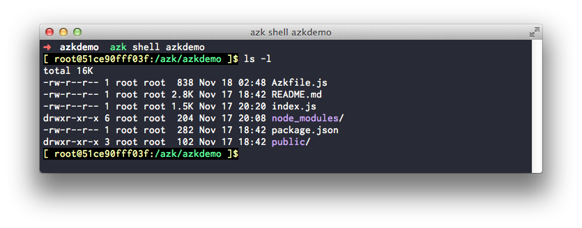

# Mapeando arquivos e diretórios

Se observarmos o `Azkfile.js` gerado, é possível notar uma entrada no sistema `azkdemo` chamada `mounts`:

!INCLUDE "../../common/getting-started/mounts_example.md"

Esta entrada basicamente orienta o `azk` sobre quais arquivos locais devem estar disponíveis para sua aplicação no ambiente isolado onde ela irá rodar. Neste caso, a pasta atual, ou seja, a pasta `azkdemo` vai estar disponível no path `/azk/azkdemo` dentro do ambiente isolado.

Se acessarmos o **shell** do sistema `azkdemo` será possível listar os arquivos da pasta `azkdemo` conforme o esperado:

Observe que, ao executar `azk shell`, você foi enviado para pasta `/azk/azkdemo`, esse _path_ corresponde a entrada `workdir` do Azkfile.js, que tem o valor: `/azk/#{system.name}`.

O `#{system.name}` é uma notação que permite saber o nome de um sistema quando se está declarando as opções desse mesmo sistema no `Azkfile.js`. No exemplo do início dessa sessão o valor será expandido para `azkdemo`.

