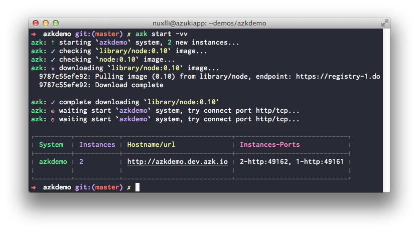
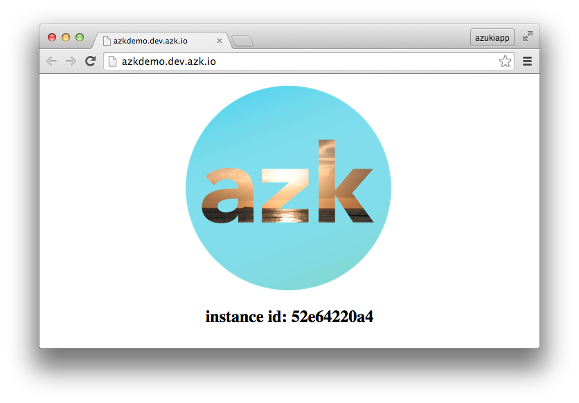
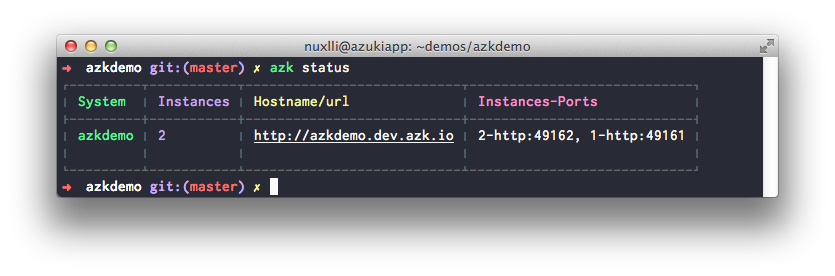

# Rodando a aplicação

Uma vez que o `Azkfile.js` esteja criado, estamos prontos para levantar nossa aplicação:

```bash
$ azk start -vv
```

A saída do comando acima deve ser algo parecido com isso:



Se tudo ocorreu conforme o esperado agora você pode acessar [http://azkdemo.dev.azk.io](http://azkdemo.dev.azk.io) e a seguinte tela deve aparecer:



> **Importante**: Caso aconteça um erro "Webpage is not available", você pode precisar reiniciar seu computador para que ele reconheça o arquivo azk.dev.io referente ao DNS resolver. Você pode confirmar isso executando:

> ```$ scutil --dns```

> E checando se o output inclui o nome azk.dev.io. Mais informações podem ser encontradas aqui.

Observe que ao atualizar a página algumas vezes o `instance id` é alterado para um outro valor. Isso ocorre pois existe um balanceador de carga que aponta para uma das 2 instâncias do site.

Na saída do `azk status` podemos conferir que existem 2 instâncias do sistema azkdemo:



Esta configuração, de se usar duas instâncias, está definida no Azkfile.js (gerado no [passo anterior](configs-project.md)):

```js
  //...
  scalable: {"default": 2},
  //...
```
