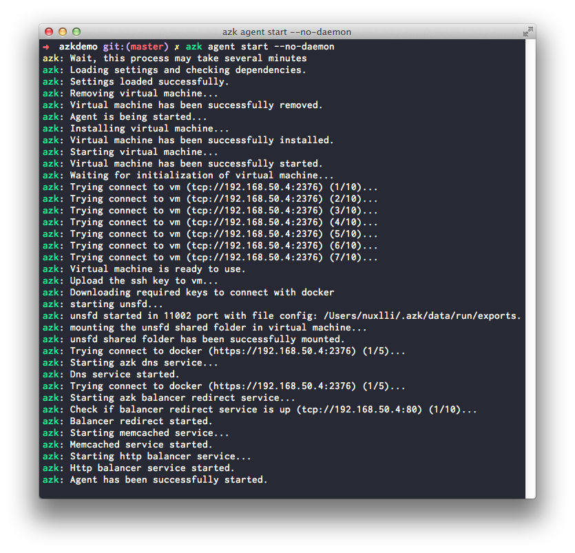

# Levantando o agent

O `azk agent` é o **serviço principal** do `azk`. Detalhes de suas atribuições e funcionalidades podem ser consultadas [aqui](../agent/README.md). Por hora é importante saber que sua execução é necessária para a maior parte das tarefas do `azk`.

Para garantir que o `azk agent` **esteja em execução**, você deve executar o seguinte comando em um **console**:

```bash
$ azk agent start
```

A saída deve variar um pouco conforme a plataforma (Linux ou Mac). Mas no geral deve se esperar pela mensagem **"Agent has been successfully started"**, para só então dar continuidade neste guia.

> **Importante**: Nunca execute o `azk agent start` como super usuário (nem mesmo usando sudo), isso pode gerar um estado inconsistente que pode levar o `azk agent` a não funcionar.

Um exemplo de saída para o comando:


